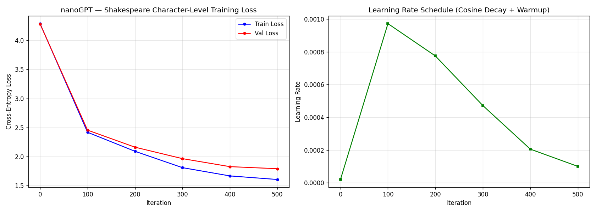

# nanoGPT on Colab GPU

Train [karpathy/nanoGPT](https://github.com/karpathy/nanoGPT) on a Google Colab T4 GPU using the `colab` CLI. Character-level language model on Tiny Shakespeare.

## Quickstart

```bash
# Provision T4 GPU session
colab new --gpu T4 -s nanogpt

# Upload training script
colab upload train_nanogpt.py /content/train_nanogpt.py

# Launch (installs deps, spawns detached training)
colab exec -f launch.py --timeout 180

# Wait ~7 min, then download results
export no_proxy="*.colab.dev,*.prod.colab.dev,localhost,127.0.0.1"
colab download /content/out-nanogpt/loss_curve.png results/
colab download /content/out-nanogpt/metrics.json results/
colab download /content/out-nanogpt/samples.json results/
colab download /content/nanogpt_train.log results/

# Clean up
colab stop -s nanogpt
```

## Configuration

| Parameter | Value |
|-----------|-------|
| Model | GPT (6 layers, 6 heads, 384 embed) |
| Params | 10.75M |
| Dataset | Tiny Shakespeare (~1M chars, vocab 65) |
| Block size | 256 |
| Batch size | 64 |
| Max iterations | 500 |
| Optimizer | AdamW (fused), lr=1e-3, cosine decay |
| Mixed precision | bfloat16 (autocast) |
| Compilation | torch.compile (falls back on T4 — no native bf16 compile) |

## Results (T4, ~7 min)



| Metric | Start | End |
|--------|-------|-----|
| Train loss | 4.29 | **1.60** |
| Val loss | 4.28 | **1.79** |

### Generated samples (temperature=0.7)

```
Nurse:
Which the was sickly his this poather's son,
The san the cold the flace of this confrient
To the genter upon the beity, the sould face
and as deself the prought of my hearted
And me no my blood with the cannoth thee?

CLARENCE:
The come not my graents the was me let be name...
```

## Files

| File | Purpose |
|------|---------|
| `train_nanogpt.py` | Self-contained: GPT model + data prep + training + viz |
| `launch.py` | Colab launcher: pip installs deps, spawns training detached |
| `check_progress.py` | Checks process alive, tails log, lists checkpoints/plots |
| `results/` | Downloaded artifacts (loss curves, metrics, samples, log) |

## Gotchas

See [docs/model-gotchas.md](../../docs/model-gotchas.md) for issues encountered (serialization crashes, T4 bfloat16 compile, session lifetime, China proxy).
